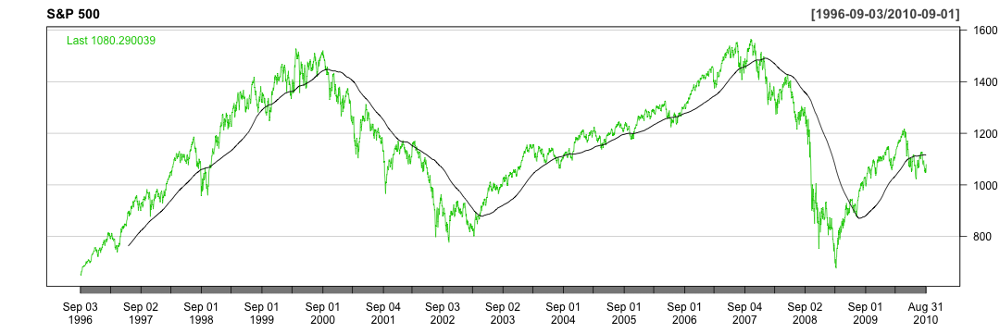

Indicators-Lite
========================================================
author: Paul Adamson
date: September 11, 2016
autosize: true

</img>

Indicators-Lite: Motivation
========================================================

The [Indicators-Lite Shiny App](https://padamson.shinyapps.io/Indicators-Lite/)
demonstrates the first of six key market indicators that can be used to 
guage potential for future stock market gains.

The six indicators are [described by Nellie S. Huang at 
Kiplinger](http://www.kiplinger.com/slideshow/investing/T052-S001-6-key-stock-market-indicators-to-watch-slide-show/index.html#VEQZcU4oQ5l0MEIz.99):

1. S&P 500 Price Versus the 200-Day Moving Average
2. Consumer Confidence
3. Weekly Unemployed Insurance Claims
4. Strength of U.S. Dollar
5. Emerging Markets
6. Price to Earnings Ratio of S&P 500

Sample Plot: S&P 500 vs. 200-Day Moving Average
========================================================

Here is an example plot of the S&P 500 
with 200-Day Moving Average encompassing both the "Dot-Com 
Bubble" of early 2000 as well as the 2008 financial crisis.

Notice that in the index failed to break above the 200-Day 
Moving Average prior to both crashes.

Indicators-Lite Interactivity
========================================================
The user can easily choose whether to plot the log of price and/or adjust 
for inflation. 

Also, a slider is provided to easily adjust the timeframe over which
the plot is made.

